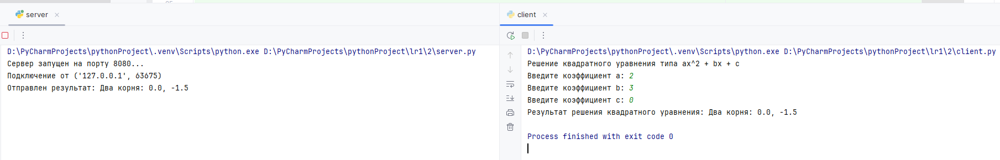

# Задание 2

## Описание
Вариант задания: 2

Реализовать клиентскую и серверную часть приложения. Клиент запрашивает выполнение расчёта квадратного уравнения,
параметры которого вводятся с клавиатуры. Сервер обрабатывает данные и возвращает результат клиенту.

## Стек

- Язык: Python
- Библиотека: socket
- Протокол: TCP

## Как запускать

1. Сервер:
    ```bash
    python3 server.py
    ```
2. Клиент:
    ```bash
    python3 client.py
    ```

## Код

client.py

```python
import socket

client_socket = socket.socket(socket.AF_INET, socket.SOCK_STREAM)
client_socket.connect(('localhost', 8080))

print(f"Решение квадратного уравнения типа ax^2 + bx + c")
a = int(input("Введите коэффициент a: "))
b = int(input("Введите коэффициент b: "))
c = int(input("Введите коэффициент c: "))

message = f"{a} {b} {c}"
client_socket.send(message.encode())

result = client_socket.recv(1024).decode()
print(f"Результат решения квадратного уравнения: {result}")

client_socket.close()
```

server.py

```python
import math
import socket


def calculate_quadratic_equation(a, b, c):
    if a == 0:
        if b == 0:
            return "Нет решений" if c != 0 else "Бесконечно много решений"
        return f"Линейное уравнение, корень: {-c / b}"

    discriminant = b ** 2 - 4 * a * c

    if discriminant > 0:
        x1 = (-b + math.sqrt(discriminant)) / (2 * a)
        x2 = (-b - math.sqrt(discriminant)) / (2 * a)
        return f"Два корня: {x1}, {x2}"
    elif discriminant == 0:
        x = -b / (2 * a)
        return f"Один корень: {x}"
    else:
        return "Нет вещественных корней"


server_socket = socket.socket(socket.AF_INET, socket.SOCK_STREAM)

server_socket.bind(('localhost', 8080))

server_socket.listen(1)
print("Сервер запущен на порту 8080...")

while True:
    client_connection, client_address = server_socket.accept()
    print(f'Подключение от {client_address}')

    data = client_connection.recv(1024).decode()
    if not data:
        break
    a, b, c = map(int, data.split())
    result = calculate_quadratic_equation(a, b, c)
    client_connection.send(str(result).encode())
    print(f'Отправлен результат: {result}')

    client_connection.close()


```

## Скриншоты
