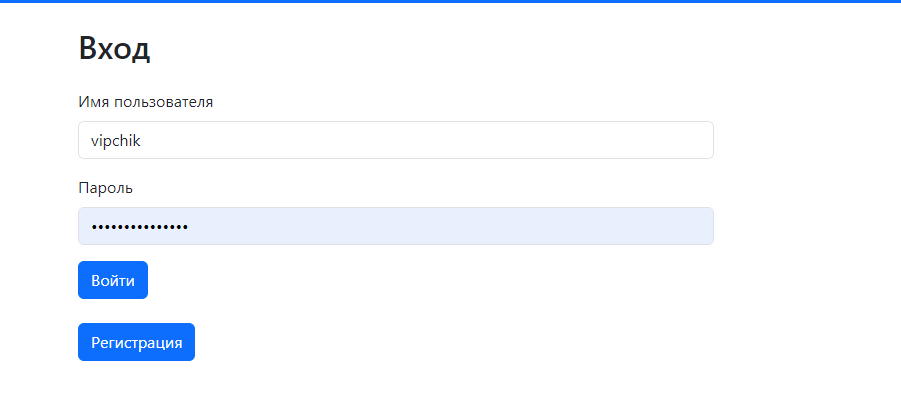
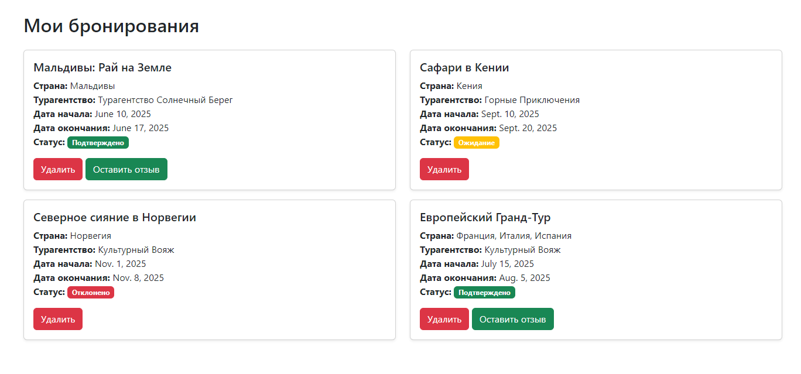
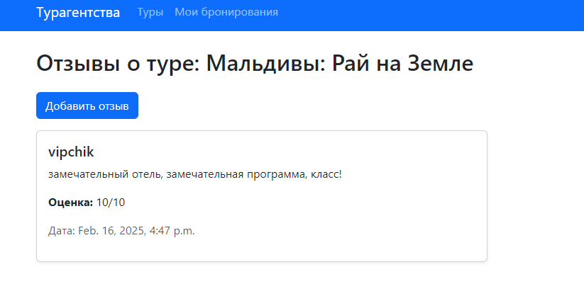
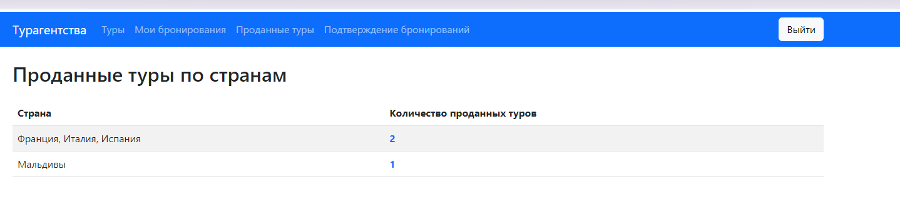

# Лабораторная работа №2

Хранится информация о названии тура, турагенстве, описании тура, периоде
проведения тура, условиях оплаты.
Необходимо реализовать следующий функционал:
-  Регистрация новых пользователей.
-  Просмотр и резервирование туров. Пользователь должен иметь возможность
редактирования и удаления своих резервирований.
-  Написание отзывов к турам. При добавлении комментариев, должны
сохраняться даты тура, текст комментария, рейтинг (1-10), информация о
комментаторе.
-  Администратор должен иметь возможность подтвердить резервирование
тура средствами Django-admin.
-  В клиентской части должна формироваться таблица, отображающая все
проданные туры по странам.

## Ход выполнения работы

### models.py:
```python
  class Agency(models.Model):
    name = models.CharField(max_length=100)
    description = models.TextField()
    contact_email = models.EmailField()
    phone = models.CharField(max_length=20)
  
  
  class Tour(models.Model):
      name = models.CharField(max_length=100)
      agency = models.ForeignKey(Agency, on_delete=models.CASCADE, related_name="tours")
      description = models.TextField()
      start_date = models.DateField()
      end_date = models.DateField()
      payment_terms = models.TextField()
      country = models.CharField(max_length=100)
  
  
  class Reservation(models.Model):
      STATUS_CHOICES = [
          ('pending', 'Ожидание'),
          ('approved', 'Подтверждено'),
          ('rejected', 'Отклонено'),
      ]
  
      user = models.ForeignKey(User, on_delete=models.CASCADE)
      tour = models.ForeignKey(Tour, on_delete=models.CASCADE)
      status = models.CharField(max_length=10, choices=STATUS_CHOICES, default='pending')


  class Review(models.Model):
    reservation = models.ForeignKey(Reservation, on_delete=models.CASCADE)
    user = models.ForeignKey(User, on_delete=models.CASCADE)
    text = models.TextField()
    rating = models.IntegerField(validators=[MinValueValidator(1), MaxValueValidator(10)])
    date_posted = models.DateTimeField(auto_now_add=True)
```


### forms.py:

    class ReservationCreateForm(forms.ModelForm):
    class Meta:
        model = Reservation
        fields = []


    class ReviewCreateForm(forms.ModelForm):
        class Meta:
            model = Review
            fields = ["text", "rating"]
            widgets = {
                'text': forms.Textarea(attrs={'cols': 80, 'rows': 5}),
                'rating': forms.Select(choices=[(i, i) for i in range(1, 11)]),
       

### urls.py:

    urlpatterns = [
        path('agencies/', views.AgencyListView.as_view(), name='agencies'),
        path('agencies/<int:agency_id>/tours/', views.agency_tours, name='agency_tours'),
        path('tours/', views.TourListView.as_view(), name='tours'),
        path('tours/<int:tour_id>/reserve/', views.create_reservation, name='reserve_tour'),
        path('tours/<int:tour_id>/reviews/', TourReviewsView.as_view(), name='tour_reviews'),
        path('tours/<int:tour_id>/reviews/create/', views.create_review, name='create_review'),
        path('register/', views.register, name='register'),
        path('login/', views.login, name='login'),
        path('logout/', LogoutView.as_view(next_page=settings.LOGOUT_REDIRECT_URL), name='logout'),
        path('reservations/', views.user_reservations, name='reservations'),
        path('reservations/<int:pk>/delete/', views.ReservationDeleteView, name='reservation_delete'),
        path('pending-reservations/', views.pending_reservations, name='pending_reservations'),
        path('update-reservation-status/<int:pk>/<str:new_status>/', views.update_reservation_status,
             name='update_reservation_status'),
        path('sold-tours/', views.sold_tours_by_country, name='sold_tours_by_country'),
    ]

## Результат

### Турагенства:


### Туры турагенства:


### Страница авторизации:


### Страница регистрации:


### Список бронирований пользователя


### Подтверждение бронирований


### Список туров


### Отзывы о туре


### Просмотр туров по странам
