# Лабораторная работа 3. Реализация серверной части на django rest. Документирование API

## Описание эндпоинтов
### Manufactory
#### Breeds
1 **Получить список пород**
```
GET /manufactory/breeds/
```
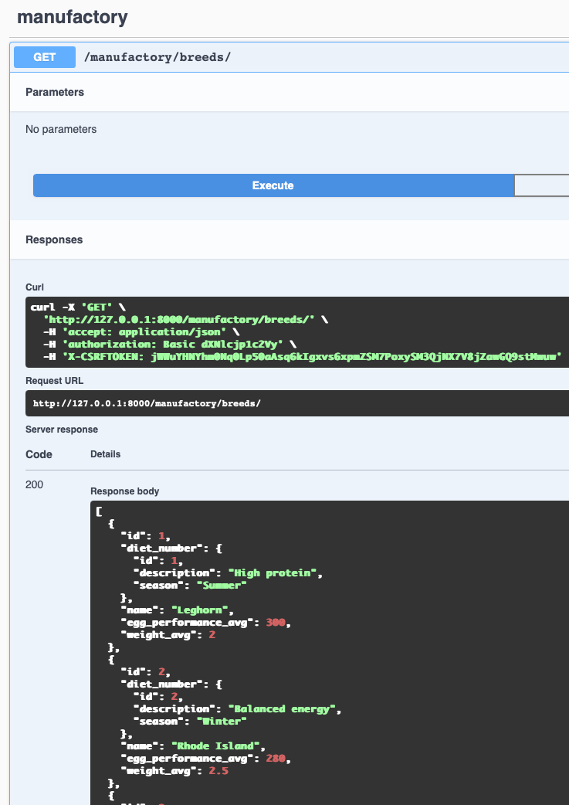

2 **Добавить породу**

```
POST /manufactory/breeds/
```
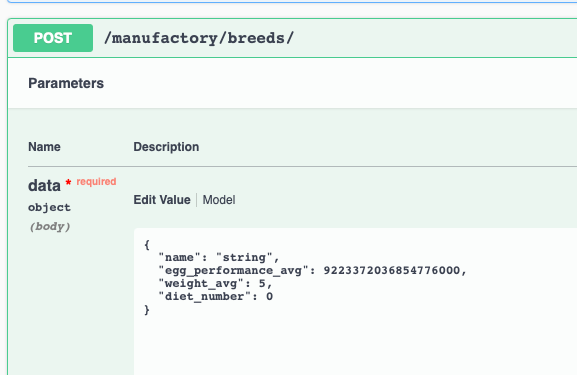
3 **Получить разницу между средним значением производительности породы и средним числом по цеху**
```
GET /manufactory/breeds/difference/
```
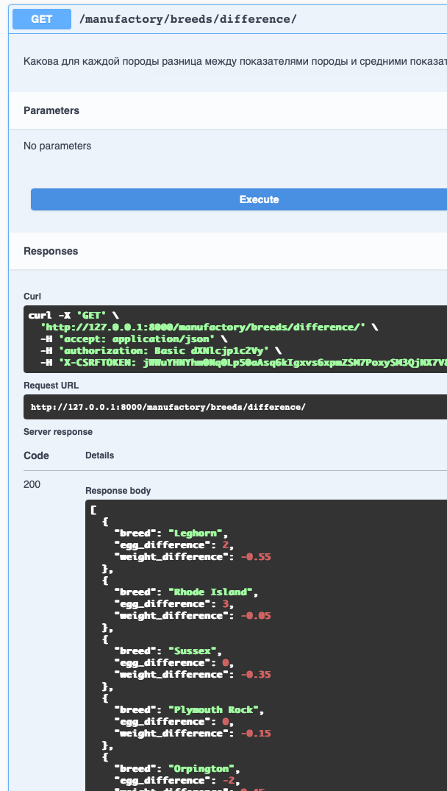
4 **Получить детальную информацию о породе**
```
GET /manufactory/breeds/{id}
```
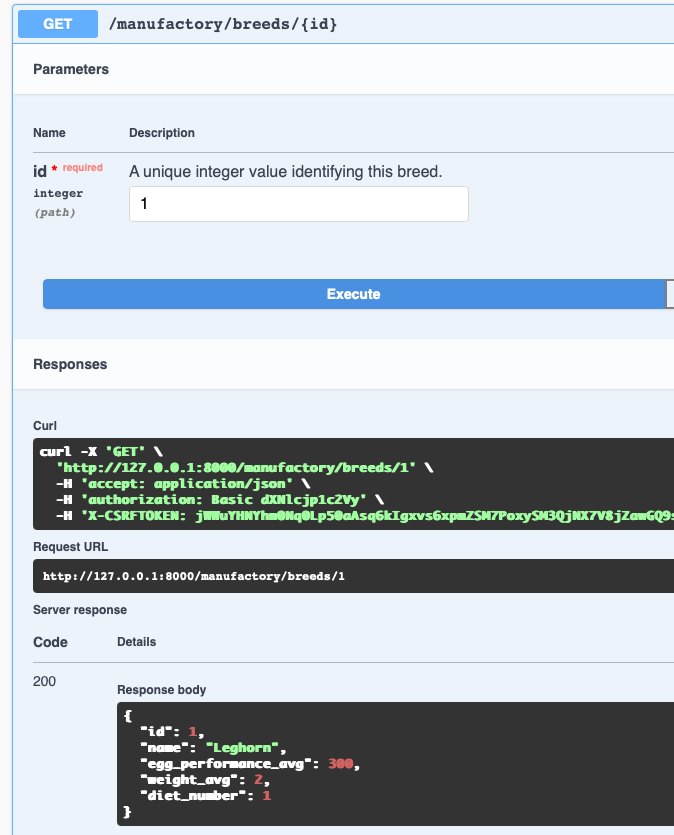
5 **Изменить породу**
```
UPDATE /manufactory/breeds/{id}
```

6 **Изменить породу**
```
PATCH /manufactory/breeds/{id}
```
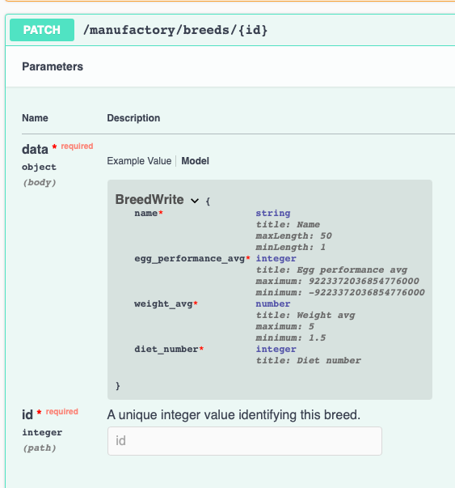
7 **Удалить породу**
```
DELETE /manufactory/breeds/{id}
```

#### Cells
8 **Получить список клеток**
```
GET /manufactory/cells/
```
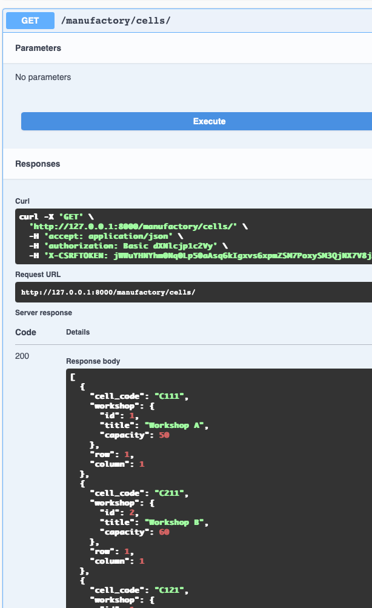
9 **Добавить клетку**
```
POST /manufactory/cells/
```


#### Chicken
10 **Получить список куриц**
```
GET /manufactory/chicken/
```
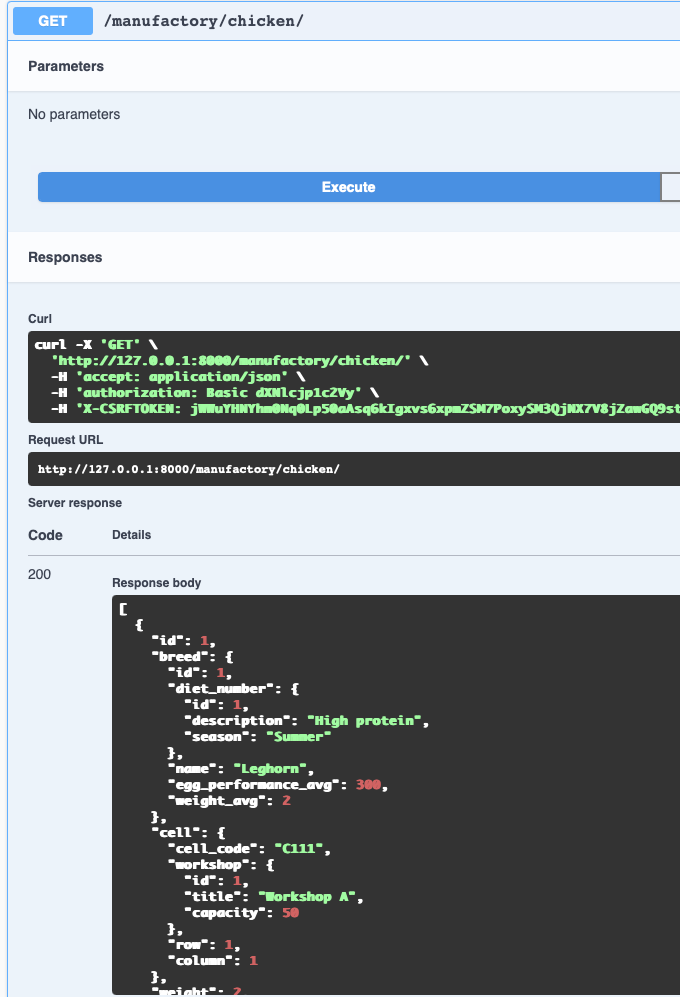
11 **Добавить курицу**
```
POST /manufactory/chicken/
```
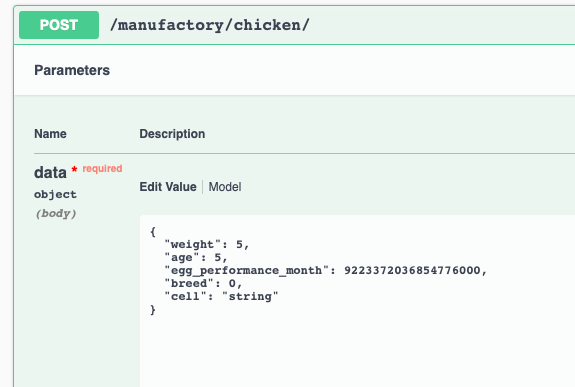
12 **Удалить курицу**
```
DELETE /manufactory/chicken/{id}
```
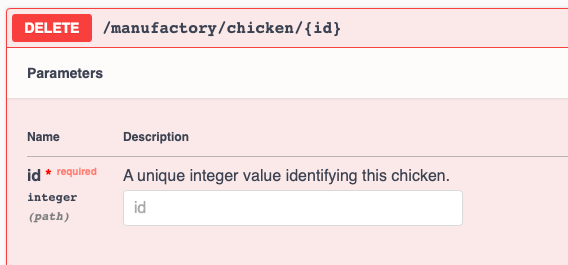

13 **Получить информацию о курице**
```
GET /manufactory/chicken/{id}
```
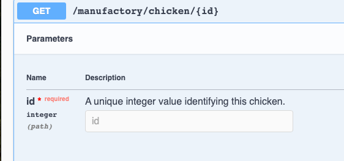
14 **Изменить информацию о курице**
```
PUT /manufactory/chicken/{id}
```

15 **Изменить информацию о курице**
```
PATCH /manufactory/chicken/{id}
```

#### Diets
16 **Получить список диет**
```
GET /manufactory/diets/
```
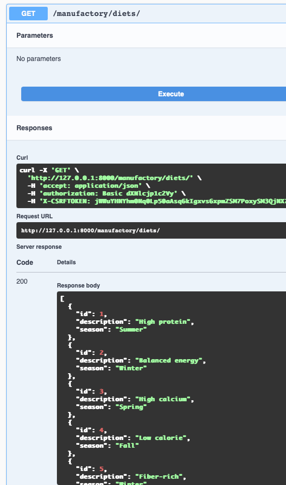


### Auth
32 **Получить токен юзера по паролю и никнейму**
```
POST /auth/token/login
```
33 **Вывести информацию о пользователе**
```
GET /auth/users/me
```
34 **Зарегистрировать пользователя**
```
POST /auth/users
```


# views.py (отрывок)

        class EmployeeAPIView(GenericAPIView):
            permission_classes = [IsAuthenticated]
            serializer_class = EmployeeSerializer
        
            def get(self, request):
                employees = Employee.objects.all()
                serializer = EmployeeSerializer(employees, many=True)
                return Response(serializer.data)
        
            def post(self, request):
                serializer = EmployeeSerializer(data=request.data)
                if serializer.is_valid():
                    serializer.save()
                    return Response(serializer.data, status=status.HTTP_201_CREATED)
                return Response(serializer.errors, status=status.HTTP_400_BAD_REQUEST)
        
        
        class EmployeeDetailsAPIView(generics.RetrieveUpdateDestroyAPIView):
            permission_classes = [IsAuthenticated]
            serializer_class = EmployeeSerializer
            queryset = Employee.objects.all()
        
        
        class ResponsibleEmployeeAPIView(APIView):
            permission_classes = [IsAuthenticated]
            serializer_class = ResponsibleEmployeeWriteSerializer
        
            def get(self, request):
                employees = ResponsibleEmployee.objects.all()
                serializer = ResponsibleEmployeeSerializer(employees, many=True)
                return Response(serializer.data)
        
            def post(self, request):
                serializer = ResponsibleEmployeeWriteSerializer(data=request.data)
                if serializer.is_valid():
                    serializer.save()
                    return Response(serializer.data, status=status.HTTP_201_CREATED)
                return Response(serializer.errors, status=status.HTTP_400_BAD_REQUEST)
        
        
        class ResponsibleEmployeeDetailsAPIView(generics.RetrieveUpdateDestroyAPIView):
            permission_classes = [IsAuthenticated]
            serializer_class = ResponsibleEmployeeWriteSerializer
            queryset = ResponsibleEmployee.objects.all()